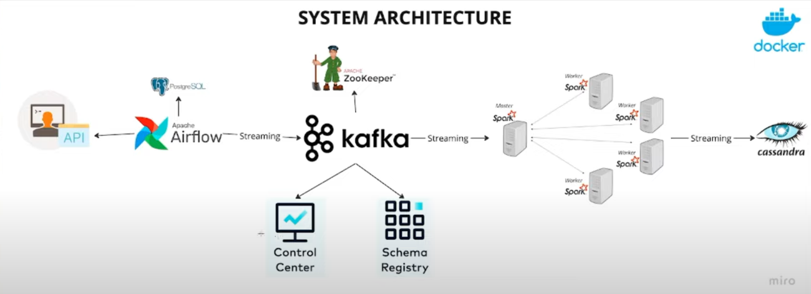

# Realtime Data Streaming | End-to-End Data Engineering Project

## 📜 Table of Contents
- [System architecture](#System-architecture)
- [Overview](#Overview)
- [Key Components](#Key-Components)
- [System Workflow](#System-Workflow)
- [Key Features](#Key-Features)
- [Business Value](#Business-Value)
- [Technical challenges and solutions](#Technical-Challenges-And-Solutions)
- [Setup Instructions](#Setup-Instructions)
- [TroubleShooting](#Trouble-Shooting)

## System architecture:


## Overview:
This project is a real-time data streaming and processing pipeline designed to handle high-velocity data streams, perform real-time analytics, 
and store processed data for further querying and analysis. The system leverages modern big data technologies such as Apache Kafka, Apache Spark, 
Apache Cassandra, and Apache Airflow, all containerized and orchestrated using Docker. This ensures a robust, scalable, and efficient data 
processing architecture that is easy to deploy, manage, and scale.

## Key Components:
1. #### Apache Kafka:
- Acts as the data ingestion layer, collecting and storing real-time data streams (e.g., user events, logs, or sensor data).
- Topics (e.g., users_created) are used to organize and partition data streams.
  
2. #### Apache Spark:
- Serves as the streaming data processing engine, consuming data from Kafka topics in real-time.
- Performs transformations, aggregations, and analytics on the streaming data.
- Writes processed data to a sink (e.g., Cassandra) for persistent storage.

3. #### Apache Cassandra:
- Acts as the data storage layer, storing processed data for querying and further analysis.
- Provides high availability, scalability, and fault tolerance for large-scale data.

4. #### Apache Airflow:
- Orchestrates and schedules data processing workflows, including Spark jobs.
- Ensures that data pipelines run reliably and efficiently.

5. #### ZooKeeper:
- Manages and coordinates Kafka brokers, ensuring high availability and fault tolerance.

6.  #### Docker:
- Provides a containerized environment for deploying and managing all components (Kafka, Spark, Cassandra, Airflow, Zookeeper).
- Ensures consistency, scalability, and ease of maintenance across development, testing, and production environments.

## System Workflow:
#### Data Ingestion:
- Real-time data is ingested into Kafka topics (e.g., users_created).

#### Data Processing:
- Spark Streaming consumes data from Kafka topics, processes it (e.g., filtering, aggregation, enrichment), and writes the results to Cassandra.

#### Data Storage:
- Processed data is stored in Cassandra for persistent storage and querying.

#### Orchestration:
- Airflow schedules and monitors Spark jobs, ensuring that data pipelines run as expected.

#### Containerization:
- All components (Kafka, Spark, Cassandra, Airflow, Zookeeper) are containerized using Docker, ensuring portability, scalability, and ease of deployment.

## Key Features:
- Real-Time Processing: Enables real-time analytics and insights on streaming data.
- Scalability: Designed to handle large volumes of data with distributed processing and storage.
- Fault Tolerance: Ensures high availability and reliability through Kafka, Spark, and Cassandra.
- Orchestration: Automates and monitors data pipelines using Airflow.
- Containerization: Uses Docker to ensure consistency, portability, and ease of deployment.

## Business Value:
##### This system enables businesses to:
- Process and analyze real-time data streams (e.g., user events, IoT sensor data).
- Generate real-time insights for decision-making (e.g., click-through rates, anomaly detection).
- Scale seamlessly to handle large volumes of data.
- Reduce deployment and maintenance overhead using Docker."

## Technical Challenges and Solutions:
##### Some challenges I faced included:
- Kafka broker connectivity issues: Resolved by ensuring proper configuration of KAFKA_ADVERTISED_LISTENERS and verifying Zookeeper connectivity.
- Spark-Cassandra integration: Addressed by using the spark-cassandra-connector library and optimizing data writes.
- Docker networking: Solved by creating a dedicated Docker network (kafka-net) for seamless communication between containers."

## Setup Instructions
##### Prerequisites:
**Docker**: Install Docker from https://www.docker.com/get-started.
**Docker Compose**: Ensure Docker Compose is installed (usually comes with Docker Desktop).
**Git**: Install Git from https://git-scm.com/.

##### Step 1: Clone the Repository:
Clone the project repository to your local machine:
```bash
git clone https://github.com/auyrin/Real-time-data-streaming-e2e-Data-Engineering-Project.git
cd Real-time-data-streaming-e2e-Data-Engineering-Project
```
##### Step 2: Start the System:
```bash
docker-compose up -d
```
###### This will start the following services:
Zookeeper: Manages Kafka brokers.
Kafka: Handles real-time data streaming.
Cassandra: Stores processed data.
Spark: Processes streaming data.
Airflow: Orchestrates data pipelines.

##### Step 3: Verify Services:
##### Kafka:
Create a Kafka topic:
```bash
docker exec -it kafka1 kafka-topics --create --bootstrap-server localhost:9093 --topic users_created --partitions 1 --replication-factor 1
```
List topics to verify:
```bash
docker exec -it kafka1 kafka-topics --list --bootstrap-server localhost:9093
```
##### Cassandra:
Connect to Cassandra using cqlsh:
```bash
docker exec -it cassandra cqlsh
```
##### Airflow:
Access the Airflow UI at http://localhost:8083.
Default credentials: admin / admin.

##### Spark:
Access the Spark UI at http://localhost:9090.

##### Step 4: Run the Spark Streaming Application:
Submit the Spark Streaming job:
```bash
spark-submit spark_stream.py
```
Verify that data is being processed and stored in Cassandra:
```
docker exec -it cassandra cqlsh
select * from spark_streams.created_users;
```

##### Step 5: Stop the System:
To stop all services, run:
```bash
docker-compose down
```
## TroubleShooting:
##### Kafka Broker Not Available:
Ensure Kafka and Zookeeper are running:
```
docker logs kafka1
docker logs zookeeper1
```
##### Cassandra Connection Issues:
Verify that Cassandra is running and accessible:
```
docker logs cassandra
```
##### Spark Job Failures:
Check the Spark logs for errors:
```
docker logs spark-master
```
